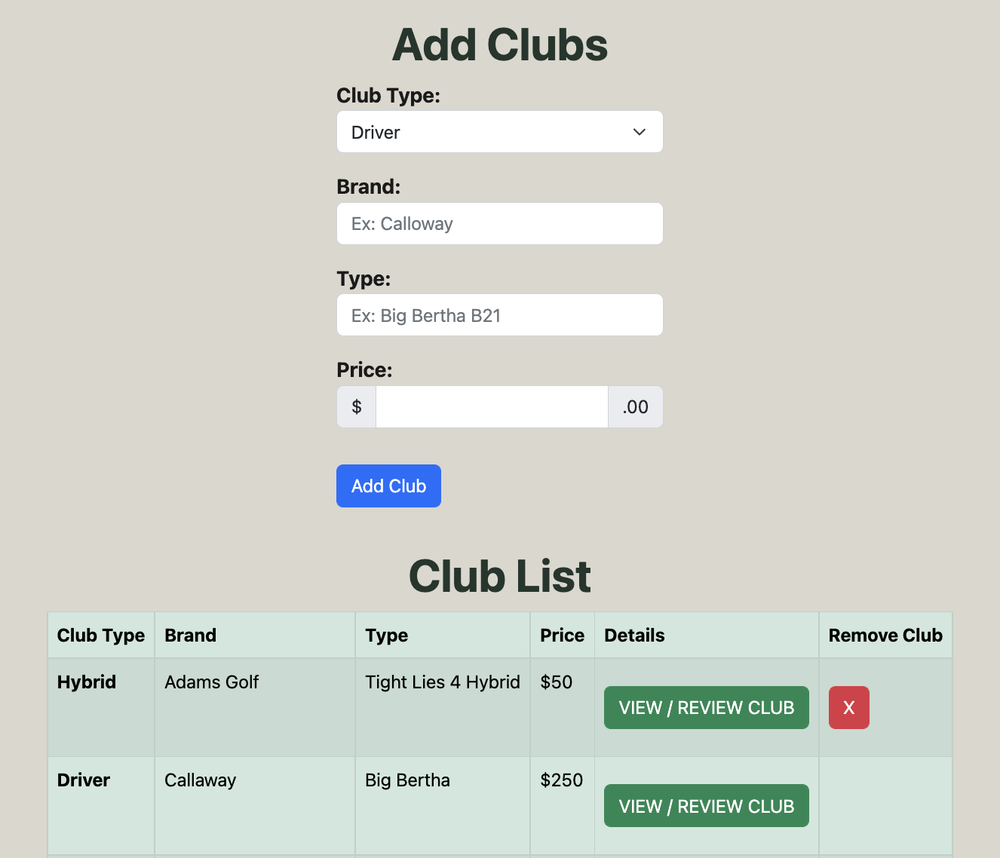

# My Golf Bag

---

## Click [here](https://my-golf-bag.fly.dev/) to take a look at My Golf Bag
---
### Trello Planning board [here](https://trello.com/b/GELMIFxq/my-golf-bag) 

### Goal 
- Buying the right golf clubs is never an easy thing to do whether you are new to the game of golf or not
- With My Golf Bag it allows for new or experienced golfers to create a golf bag and add clubs that are specific to them 
- Each bag will show the clubs that the user picks as well as any reviews that may be attached to each club 
- Each bag will show a total bag cost as well as a rating of the bag which is all to help the user get a feel for clubs they may want to buy in the future

### How it works:
- Sign in with your Google account 
- Click Bags 
- Add a unique bag 
- Add clubs to your desire from the dropdown 
- If your desired club is not in the dropdown then click New club
- Add your new club and view/review the club 
- Navigate back to bags and add your club

### Screenshots

### Technologies used 
- JavaScript
- HTML
- CSS
- Node
- MongoDB
- Mongoose
- Bootstrap
- Google OAuth
### Credits
- Intro Photo || https://riversedgegolfbend.com/bend-oregon-golf-blog/spring-golfing-tips-in-oregon/

### Icebox
- AAU I want to show how common a club is and whether or not it is in many bags or just the one
- AAU I want to be able to click on my profile and see my bag
- AAU I want to add notes about my bag to be able to explain what kind of golfer I am and what clubs I prefer

